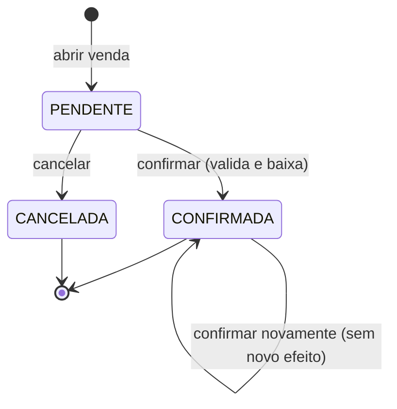
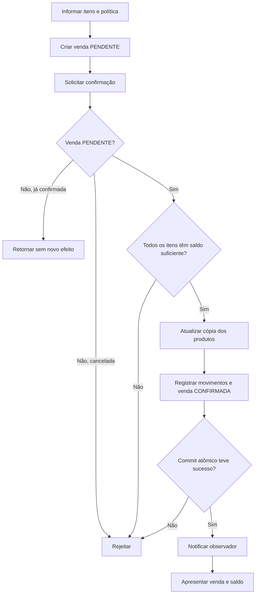
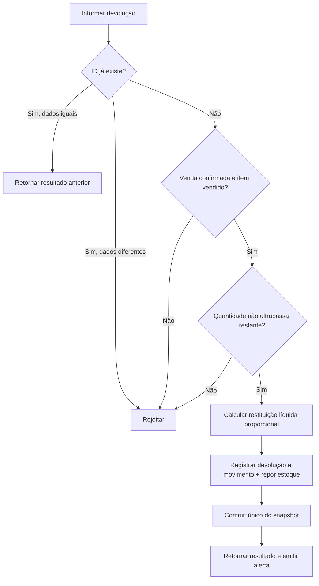

# Diagramas de fluxo e estados (Mermaid)

## Estados de venda

```mermaid
stateDiagram-v2
    [*] --> PENDENTE: abrir venda
    PENDENTE --> CONFIRMADA: confirmar (valida e baixa)
    PENDENTE --> CANCELADA: cancelar
    CONFIRMADA --> CONFIRMADA: confirmar novamente (sem novo efeito)
    CONFIRMADA --> [*]
    CANCELADA --> [*]
```

## Fluxo da venda

```mermaid
flowchart TD
    A[Informar itens e política] --> B[Criar venda PENDENTE]
    B --> C[Solicitar confirmação]
    C --> D{Venda PENDENTE?}
    D -- Não, já confirmada --> E[Retornar sem novo efeito]
    D -- Não, cancelada --> X[Rejeitar]
    D -- Sim --> F{Todos os itens têm saldo suficiente?}
    F -- Não --> X
    F -- Sim --> G[Atualizar cópia dos produtos]
    G --> H[Registrar movimentos e venda CONFIRMADA]
    H --> I{Commit atômico teve sucesso?}
    I -- Não --> X
    I -- Sim --> J[Notificar observador]
    J --> K[Apresentar venda e saldo]
```

## Fluxo da devolução

```mermaid
flowchart TD
    A[Informar devolução] --> B{ID já existe?}
    B -- Sim, dados iguais --> C[Retornar resultado anterior]
    B -- Sim, dados diferentes --> X[Rejeitar]
    B -- Não --> D{Venda confirmada e item vendido?}
    D -- Não --> X
    D -- Sim --> E{Quantidade não ultrapassa restante?}
    E -- Não --> X
    E -- Sim --> F[Calcular restituição líquida proporcional]
    F --> G[Registrar devolução e movimento + repor estoque]
    G --> H[Commit único do snapshot]
    H --> I[Retornar resultado e emitir alerta]
```
